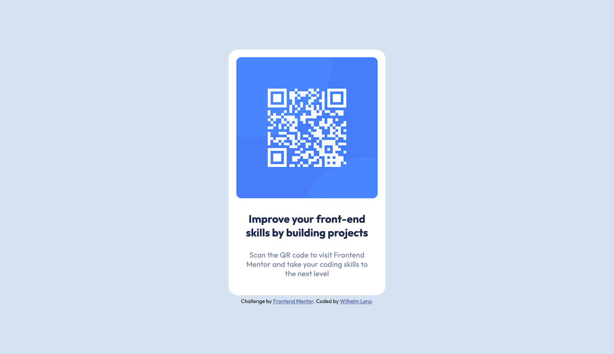

# Frontend Mentor - QR code component solution

This is a solution to the [QR code component challenge on Frontend Mentor](https://www.frontendmentor.io/challenges/qr-code-component-iux_sIO_H). Frontend Mentor challenges help you improve your coding skills by building realistic projects.

## Table of contents

- [Overview](#overview)
  - [Screenshot](#screenshot)
  - [Links](#links)
- [My process](#my-process)
  - [Built with](#built-with)
  - [What I learned](#what-i-learned)
  - [Continued development](#continued-development)
  - [Useful resources](#useful-resources)
- [Author](#author)

**Note: Delete this note and update the table of contents based on what sections you keep.**

## Overview

### Screenshot

#### Desktop:

#### Mobile:

### Links

- Solution URL: [index.html](https://github.com/metatron1986/web-components/blob/main/qr-code-component-main/index.html)
- Live Site URL: [qr-code-component](https://metatron1986.github.io/web-components/qr-code-component-main/)

## My process

### Built with

- Semantic HTML5 markup
- CSS custom properties
- Flexbox

### What I learned

It is crucial to think thoroughly about the HTML structure first. A well thought-out structure is essential not only for the organization of the code, but also for later styling. When styling, it is advisable to proceed systematically: You should work from the top down, completing each section before moving on to the next.

### Continued development

In the next development phase I plan to switch the project to a grid system. Instead of the traditional media queries, I want to use container queries. This will allow for contextual adaptation of content that no longer depends on fixed breakpoints. This approach is future-oriented and in line with current best practices in web development. Container queries offer a more flexible and modular design that facilitates project maintenance and scalability.

### Useful resources

Currently, I have not called on any external resources, as I have been able to implement the project independently. However, appropriate resources will be brought in for future development.

## Author

- Frontend Mentor - [@metatron1986](https://www.frontendmentor.io/profile/metatron1986)
