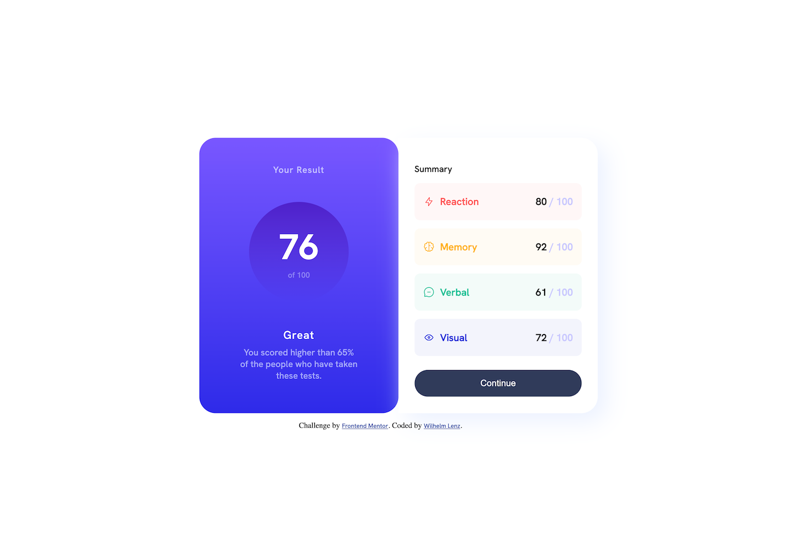
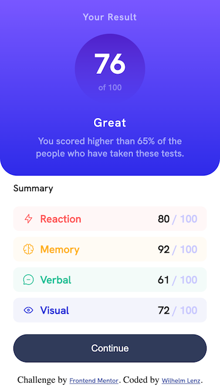

# Frontend Mentor - Results summary component solution

This is a solution to the [Results summary component challenge on Frontend Mentor](https://www.frontendmentor.io/challenges/results-summary-component-CE_K6s0maV). Frontend Mentor challenges help you improve your coding skills by building realistic projects.

## Table of contents

- [Overview](#overview)
  - [The challenge](#the-challenge)
  - [Screenshot](#screenshot)
  - [Links](#links)
- [My process](#my-process)
  - [Built with](#built-with)
  - [What I learned](#what-i-learned)
  - [Continued development](#continued-development)
  - [Useful resources](#useful-resources)
- [Author](#author)

**Note: Delete this note and update the table of contents based on what sections you keep.**

## Overview

### The challenge

Users should be able to:

- View the optimal layout for the interface depending on their device's screen size
- See hover and focus states for all interactive elements on the page
- **Bonus**: Use the local JSON data to dynamically populate the content

### Screenshot

#### Desktop:



#### Mobile:



### Links

- Solution URL: [index.html](https://github.com/metatron1986/web-components/blob/main/results-summary-component/index.html)
- Live Site URL: [results-summary-component](https://metatron1986.github.io/web-components/results-summary-component/)

## My process

### Built with

- Semantic HTML5 markup
- CSS custom properties
- JavaScript with JSON access
- Flexbox
- Mobile-first workflow

### What I learned

I've realized that planning the application structure before diving into the actual development process is crucial. HTML is naturally the starting point; if the structure isn't well-designed here, working with CSS technologies like Flexbox or Grid becomes significantly more challenging.

While implementing functionality with JavaScript was relatively smooth—thanks in part to my prior experience—the integration of data from the JSON file into the GitHub Pages environment posed a particular challenge. On my local server, accessing the data using a relative path worked perfectly. However, it became clear in the production environment on GitHub Pages that I needed to use an absolute path to enable access.

Unfortunately, this took up quite a bit of my time, even though the developer console was showing errors that I was checking.

```css
.result-wrapper {
  background: linear-gradient(
    180deg,
    hsla(256, 72%, 46%, 1) 0%,
    hsla(241, 72%, 46%, 0) 100%
  );
  width: 120px;
  height: 120px;
  display: flex;
  flex-direction: column;
  justify-content: center;
  border-radius: 100%;
}
```

```js
async function fetchData() {
  try {
    const response = await fetch(
      "https://metatron1986.github.io/web-components/results-summary-component/data.json"
    );
    if (!response.ok) {
      throw new Error(`HTTP error! status: ${response.status}`);
    }
    const data = await response.json();
    if (!data) {
      throw new Error("Received null or undefined data");
    }
    return data;
  } catch (error) {
    console.log("Fehler:", error);
    return null;
  }
}
```

### Continued development

In the next development phase I plan to switch the project to a grid system. Instead of the traditional media queries, I want to use container queries. This will allow for contextual adaptation of content that no longer depends on fixed breakpoints. This approach is future-oriented and in line with current best practices in web development. Container queries offer a more flexible and modular design that facilitates project maintenance and scalability.

### Useful resources

Currently, I have not called on any external resources, as I have been able to implement the project independently. However, appropriate resources will be brought in for future development.

## Author

- Frontend Mentor - [@metatron1986](https://www.frontendmentor.io/profile/metatron1986)
